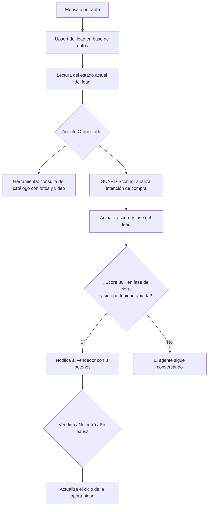

# Agente de ventas multi-agente para retail de moda

Sistema conversacional que atiende clientes, responde sobre el catálogo con fotos y videos reales,
puntúa la intención de compra y escala al vendedor humano solo cuando el lead está listo para cerrar.

**Estado:** 🟡 en validación con el cliente, funcionando de punta a punta sobre Telegram.
El vendedor está operando con el sistema y entregando observaciones que se incorporan sobre la marcha.
La migración a WhatsApp Business API está en curso, y con ella el catálogo de imágenes pasa al
Commerce Manager de Meta.

> Caso de estudio. El repositorio de cliente es privado: aquí están la arquitectura, el diseño del
> sistema de puntuación y las decisiones detrás de ellos.

---

## El problema

Un negocio de ropa que vende por chat tiene tres fugas simultáneas:

- El vendedor se satura respondiendo las mismas preguntas de gente que solo está mirando.
- Las respuestas tardan, y en chat una respuesta tardía es una venta perdida.
- No hay forma de saber a quién atender primero, así que se atiende por orden de llegada en vez de
  por probabilidad de compra.

## La arquitectura

**Orquestación:** n8n · **Estado y catálogo:** Supabase (PostgreSQL) · **Lógica conversacional:** LLMs

## El sistema de puntuación

Cada mensaje del cliente se analiza y suma temperatura en una escala de 0 a 100 puntos. El score es
**acumulativo dentro de una misma oportunidad**: no decae con el tiempo ni por inactividad. La única
forma de que retroceda es que el cliente cambie la prenda que estaba evaluando (ver más abajo).

| Señal | Puntos | Tope |
|---|---|---|
| Curiosidad — saludos, preguntas genéricas | +10 | 1 vez |
| Interés — modelos específicos, precios, tallas | +15 | 3 veces |
| Confianza — garantía, tienda física, formas de pago | +15 | 1 vez |
| Cierre — "lo quiero", "¿cómo pago?" | +40 | sin límite |

El escalamiento al humano ocurre en **80 puntos o más y en fase de cierre**. En 79 no se dispara:
el umbral es duro a propósito, porque una alerta de más le cuesta más al vendedor que una alerta tarde.

## Decisiones de diseño

**El techo es 70 sin una señal de cierre explícita.** Un cliente puede preguntar mucho, pedir fotos
de diez prendas y consultar la garantía sin ninguna intención real de comprar. Si el score fuera
puramente acumulativo, esa persona dispararía la alerta y el vendedor perdería el tiempo. Solo una
frase de compra explícita rompe el techo. El objetivo del scoring no es medir conversación, es medir
intención.

**Existe una tabla de oportunidades, no solo un score.** La primera versión notificaba con cada
mensaje que superara el umbral, y el vendedor recibía cinco alertas del mismo cliente. Modelar la
oportunidad como un ciclo con apertura y cierre resolvió el problema: mientras haya una abierta para
ese lead, no se vuelve a notificar. Un sistema de alertas que satura a quien alerta deja de ser
usado en una semana.

**Cuando entra el humano, el bot se calla.** Un flag en el lead silencia al agente mientras el
vendedor está gestionando. Dos interlocutores respondiendo en el mismo chat es peor que ninguno.

**"En pausa" no resetea nada.** De los tres botones, dos cierran la oportunidad y reinician el
score; "en pausa" devuelve el control al bot pero deja la oportunidad viva. Es el caso real del
cliente que dijo "lo pienso y te escribo": ni se vendió ni se perdió, y borrar su historial de
intención sería tirar información valiosa.

**Las fotos vienen de la base de datos, no del prompt.** El catálogo vive en tablas relacionadas
—prendas y sus medios— y se consulta en tiempo real. Así el stock y los precios que responde el
agente son los que están vigentes, no los que había cuando se escribió el prompt.

**El score sigue a la prenda, no al cliente.** Es la única excepción a la acumulación. Cuando el
cliente estaba evaluando una prenda y empieza a preguntar por otra, el score vuelve al valor que
tenía antes de que hubiera una prenda definida: se conservan las señales que pertenecen al lead
—curiosidad, confianza en la tienda— y se revierten las que estaban atadas a esa prenda concreta.
La razón es que "quiero esta blusa" seguido de "¿y esa otra?" no es intención acumulada, es
intención que se movió de sitio. Cuando esto pasa, el agente no adivina: pregunta cuál de las dos
prefiere.

**Dudar mucho también es querer comprar.** Del punto anterior salió un caso que no había previsto:
el cliente que hace muchas preguntas sobre varias prendas y no se decide por ninguna. Con la regla
anterior su score se queda bajo indefinidamente y nunca escala, aunque su intención sea altísima.
Así que hay dos caminos hacia el escalamiento: decisión clara sobre una prenda, o indecisión
intensa entre varias. En el segundo caso el vendedor recibe la alerta sabiendo que el lead va a
comprar pero no sabe qué. Entregar esa conversación puede dañar la venta —el vendedor entra en un
momento frágil—, pero la probabilidad de cerrar es mayor que dejando al agente dar vueltas.
Es un intercambio aceptado a conciencia, no un efecto secundario.

## Modelo de datos

| Tabla | Rol |
|---|---|
| `leads` | Fase, score, producto de interés y flag de escalamiento a humano |
| `prendas` | Precios, tallas, colores, stock y disponibilidad |
| `prendas_medios` | Fotos y videos por prenda, consultados vía embed de PostgREST |
| `oportunidades` | Ciclo de vida de cada escalamiento: apertura, cierre y resultado |

## Qué aprendí

Los tres aprendizajes salieron del mismo requisito del cliente: no quería que la atención se
sintiera automatizada. Ese pedido, que suena a detalle de tono, terminó definiendo la arquitectura.

**El agente califica; quien cierra es el vendedor.** Al principio vi el escalamiento como una
limitación —el bot no cierra, entonces entrega el caso—. Trabajándolo con el cliente entendí que
era al revés. El cierre es donde el vendedor aporta y donde el comprador quiere hablar con una
persona; lo que satura no es cerrar, son las primeras diez preguntas repetidas. El agente absorbe
eso y entrega la conversación caliente. Automatizar hasta el final habría empeorado el resultado,
no mejorado.

**De noche el sistema no vende: deja la venta lista.** Fuera del horario del vendedor el agente
atiende, califica y deja la oportunidad abierta con el producto de interés y el historial completo.
El vendedor confirma a primera hora. El valor de operar 24/7 no resultó ser vender de madrugada
—fue que a las 7 a.m. hubiera trabajo hecho en vez de una fila de mensajes sin responder.

**El requisito más difícil no fue técnico.** El cliente pidió que no se notara la transición entre
el agente y él. No quería un bot que se anunciara como bot: quería que el hilo sonara igual antes y
después del escalamiento. Eso convirtió el tono del vendedor en un requisito de producto, no en un
detalle de prompt, y es lo que está guiando la siguiente fase del proyecto.

## Qué sigue

- **Migración a WhatsApp Business API.** El canal donde el cliente ya vende. El catálogo de
  imágenes pasa al Commerce Manager de Meta y los tres botones de resultado —vendido, no cerró,
  en pausa— se reimplementan como botones interactivos nativos.
- **Ajustar el agente al lenguaje del vendedor**, para que el escalamiento no se note como un
  cambio de interlocutor.
- **Memoria de compras anteriores.** Hoy el cierre de una oportunidad reinicia el score. Para el
  cliente que vuelve, la idea es que el historial de `oportunidades` sirva para retomar la
  conversación reconociendo lo que ya compró, en lugar de arrancar de cero.
- **Prueba de carga.** El sistema no se ha medido con varias conversaciones simultáneas. Es la
  validación pendiente antes de considerarlo listo para volumen real.

---

Construido por [Juan Fernando Toro Isaza](https://github.com/juanftoro2006) — automatización de procesos para pymes.
